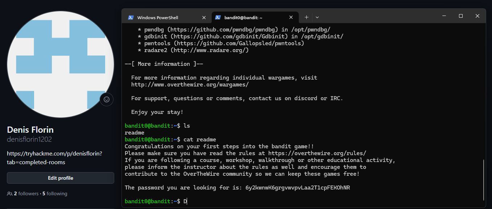

# Level 00 → 01

## Task

The password for the next level is stored in a file called `readme`.

## Commands Used

- `ls` — lists files and directories in the current directory.
- `cat readme` — displays the contents of the `readme` file.

## Screenshot

## Password

Click to reveal

`PASSWORD_HERE`

