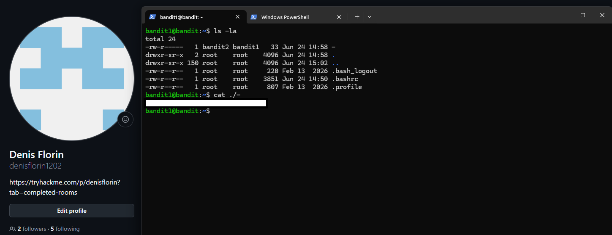

# Level 01 → 02

## Task

The password for the next level is stored in a file called `-` located in the home directory.

## Commands Used

- `ls -la` — lists all files, including hidden files, in a detailed format.
- `cat ./-` — displays the contents of the file named `-` from the current directory.

## Screenshot

## Password

Click to reveal

`PK8fYLZg2hnHSz83plBL1iEPKdD3QToB`

