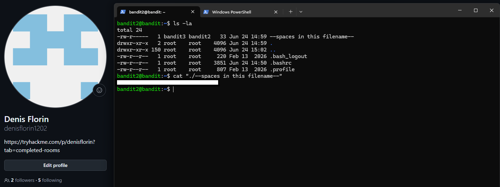

# Level 02 → 03

## Task

The password for the next level is stored in a file called `--spaces in this filename--` located in the home directory.

## Commands Used

- `ls -la` — lists all files, including hidden files, in a detailed format.
- `cat "./--spaces in this filename--"` — displays the contents of the file. The quotes keep the filename with spaces as a single argument, while `./` specifies that the file is located in the current directory.

## Screenshot

## Password

Click to reveal

`7ZZ2LFrykP2zEyvBl4m3clcL7tGYJPME`

