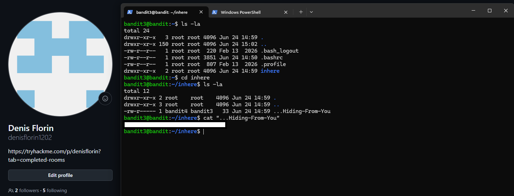

# Level 03 → 04

## Task

The password for the next level is stored in a hidden file inside the `inhere` directory.

## Commands Used

- `ls -la` — lists all files and directories, including hidden ones, in a detailed format.
- `cd inhere` — changes the current directory to `inhere`.
- `ls -la` — lists all files inside the `inhere` directory, including hidden files.
- `cat "...Hiding-From-You"` — displays the contents of the hidden file.

## Screenshot

## Password

Click to reveal

`xzTXq1rDJQVVAzdv5cHq1TQytTWufAMq`

