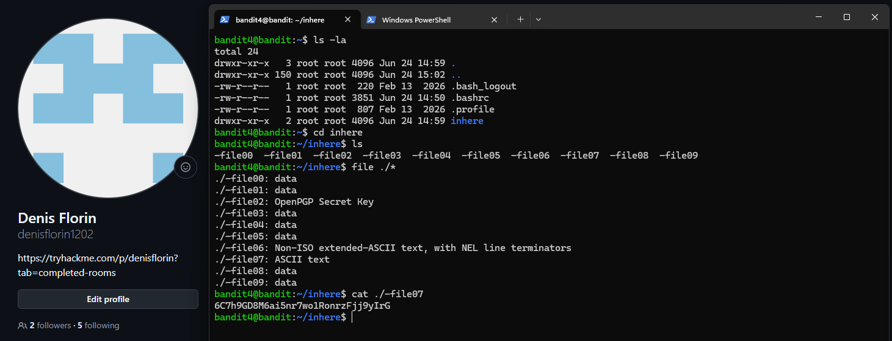

# Level 04 → 05

## Task

The password for the next level is stored in the only human-readable file inside the `inhere` directory.

## Commands Used

- `ls -la` — lists all files and directories, including hidden ones, in a detailed format.
- `cd inhere` — changes the current directory to `inhere`.
- `ls` — lists the files inside the `inhere` directory.
- `file ./*` — checks the file type of every visible file in the current directory.
- `cat ./-file07` — displays the contents of `-file07`, which was identified as an ASCII text file.

## Screenshot

## Password

Click to reveal

`PASSWORD_HERE`

