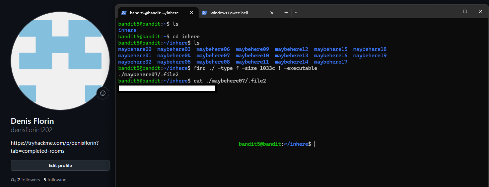

# Level 05 → 06

## Task

The password for the next level is stored in a file somewhere under the `inhere` directory and has the following properties:

- human-readable
- 1033 bytes in size
- not executable

## Commands Used

- `ls` — lists the files and directories in the current directory.
- `cd inhere` — changes the current directory to `inhere`.
- `find ./ -type f -size 1033c ! -executable` — searches recursively from the current directory for regular files that are exactly 1033 bytes and are not executable.
- `cat ./maybehere07/.file2` — displays the contents of the hidden `.file2` file found inside `maybehere07`.

## Screenshot

## Password

Click to reveal

`pXa26xhMWaC2SvDotA4r9EgZkulOeSBW`

