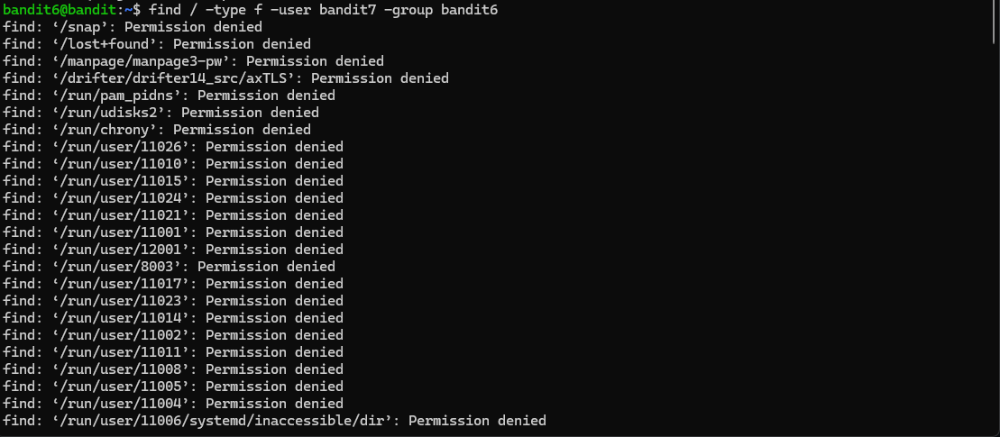
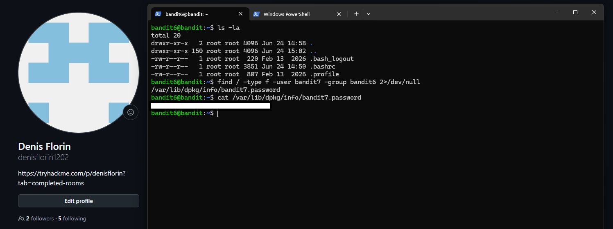

# Level 06 → 07

## Task

The password for the next level is stored somewhere on the server and has the following properties:

- owned by user `bandit7`
- owned by group `bandit6`
- 33 bytes in size

## Commands Used

- `ls -la` — lists all files and directories, including hidden ones, in a detailed format.
- `find / -type f -user bandit7 -group bandit6 -size 33c 2>/dev/null` — searches the entire filesystem for a regular file owned by user `bandit7`, owned by group `bandit6`, and exactly 33 bytes in size.

### Find Command Breakdown

- `/` — starts the search from the root directory, meaning the entire filesystem.
- `-type f` — searches only for regular files.
- `-user bandit7` — searches for files owned by user `bandit7`.
- `-group bandit6` — searches for files owned by group `bandit6`.
- `-size 33c` — searches for files exactly 33 bytes in size.
- `2>/dev/null` — redirects error messages to `/dev/null`, hiding messages such as `Permission denied`.

Without `2>/dev/null`, the command produces many `Permission denied` messages, as shown below:

Using `2>/dev/null` keeps the output clean and makes the matching file easier to identify.

## Screenshot

Final result with the password redacted:

## Password

Click to reveal

`PASSWORD_HERE`

