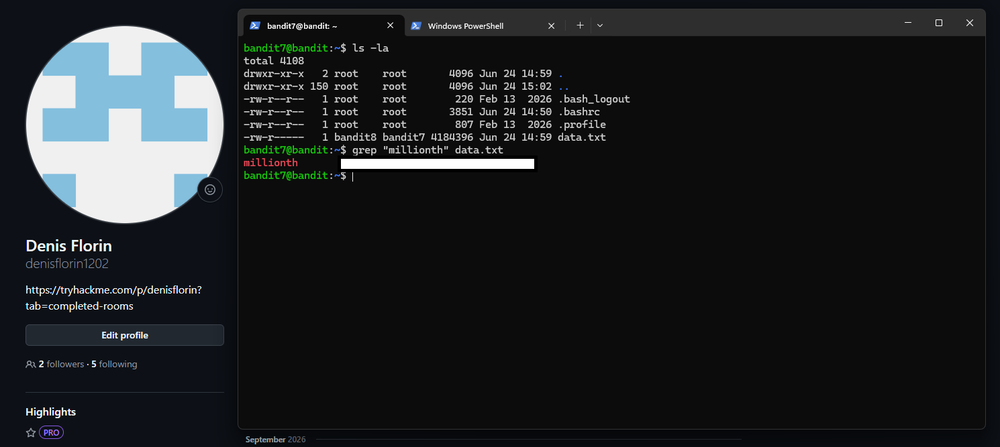

# Level 07 → 08

## Task

The password for the next level is stored in the file `data.txt` next to the word `millionth`.

## Commands Used

- `ls -la` — lists all files and directories, including hidden ones, in a detailed format.
- `grep "millionth" data.txt` — searches for the word `millionth` inside `data.txt` and displays the entire matching line.

### Useful `grep` Context Options

- `grep -A 2 "millionth" data.txt` — displays the matching line and 2 lines after it.
- `grep -B 2 "millionth" data.txt` — displays 2 lines before the matching line and the matching line itself.
- `grep -C 2 "millionth" data.txt` — displays 2 lines before and 2 lines after the matching line.

## Screenshot

## Password

Click to reveal

`PASSWORD_HERE`

