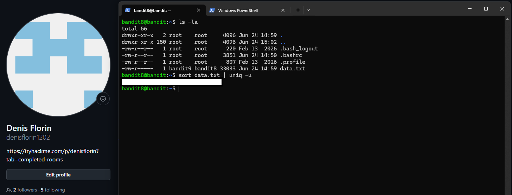

# Level 08 → 09

## Task

The password for the next level is stored in the file `data.txt` and is the only line of text that occurs only once.

## Commands Used

- `ls -la` — lists all files and directories, including hidden ones, in a detailed format.
- `sort data.txt | uniq -u` — sorts the lines in `data.txt` so identical lines are placed next to each other, then `uniq -u` displays only the line that occurs once.

### Command Breakdown

- `sort data.txt` — sorts all lines in the file.
- `|` — passes the output of `sort` as input to the next command.
- `uniq -u` — displays only lines that occur exactly once.

## Screenshot

## Password

Click to reveal

`EjmOSvuAu7sGAHqHVcBDPirRe9T03kxl`

