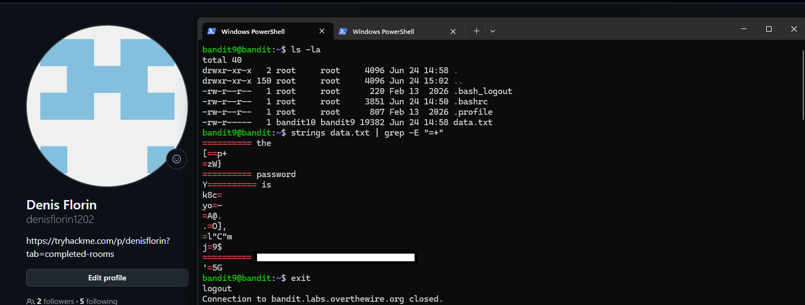

# Level 09 → 10

## Task

The password for the next level is stored in the file `data.txt` in one of the few human-readable strings, preceded by several `=` characters.

## Commands Used

- `ls -la` — lists all files and directories, including hidden ones, in a detailed format.
- `strings data.txt | grep -E "=+"` — extracts human-readable strings from `data.txt` and filters the output to show lines containing one or more `=` characters.

### Command Breakdown

- `strings data.txt` — extracts printable, human-readable strings from the file.
- `|` — passes the output of `strings` as input to `grep`.
- `grep -E "=+"` — uses extended regular expressions to search for lines containing one or more consecutive `=` characters.
- `-E` — enables extended regular expressions.
- `+` — means that the preceding character must appear one or more times.

## Screenshot

## Password

Click to reveal

`B0s2khmbT9u0geKuOoVGW3JZKhndE3BG`

