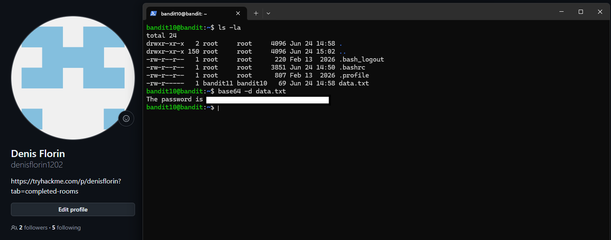

# Level 10 → 11

## Task

The password for the next level is stored in the file `data.txt`, which contains Base64 encoded data.

## Commands Used

- `ls -la` — lists all files and directories, including hidden ones, in a detailed format.
- `base64 -d data.txt` — decodes the Base64 encoded content from `data.txt`.

### Command Breakdown

- `base64` — encodes or decodes data using Base64.
- `-d` — decodes the input instead of encoding it.
- `data.txt` — the file containing the Base64 encoded text.

## Screenshot

## Password

Click to reveal

`pYfOY6HwUsDj5rL9UvyhU7MCmv8vN5Ro`

