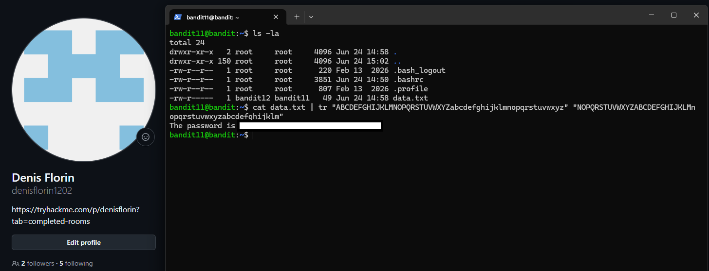

# Level 11 → 12

## Task

The password for the next level is stored in the file `data.txt`, where all lowercase (`a-z`) and uppercase (`A-Z`) letters have been rotated by 13 positions.

## Commands Used

- `ls -la` — lists all files and directories, including hidden ones, in a detailed format.
- `cat data.txt` — displays the encoded content of `data.txt`.
- `cat data.txt | tr "ABCDEFGHIJKLMNOPQRSTUVWXYZabcdefghijklmnopqrstuvwxyz" "NOPQRSTUVWXYZABCDEFGHIJKLMnopqrstuvwxyzabcdefghijklm"` — decodes the ROT13 text by translating each letter 13 positions in the alphabet.

### Command Breakdown

- `cat data.txt` — reads the contents of `data.txt`.
- `|` — passes the output of `cat` as input to `tr`.
- `tr` — translates characters from one set into the corresponding characters from another set.
- `"ABCDEFGHIJKLMNOPQRSTUVWXYZabcdefghijklmnopqrstuvwxyz"` — the original uppercase and lowercase alphabet.
- `"NOPQRSTUVWXYZABCDEFGHIJKLMnopqrstuvwxyzabcdefghijklm"` — the same alphabet rotated by 13 positions.

For example:

```text
A → N
B → O
C → P
...
N → A

a → n
b → o
c → p
...
n → a
```

This transformation is known as ROT13.

## Screenshot



## Password

<details>
<summary>Click to reveal</summary>

`GROozWPO8QyN0mGrjUkID0WCYkZiQxrN`

</details>
