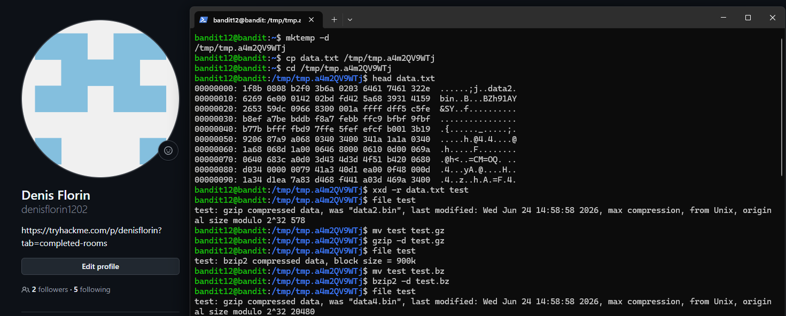
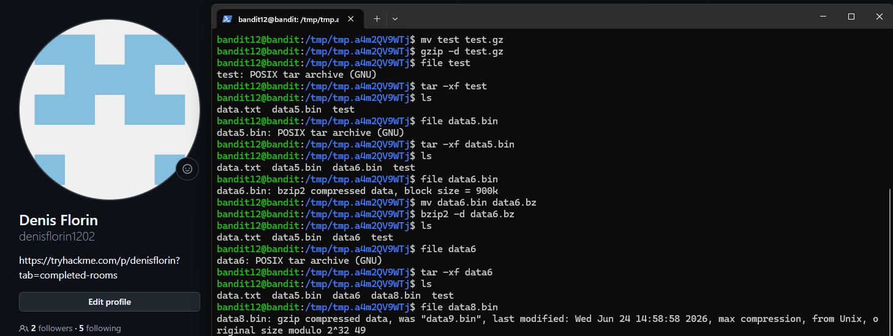
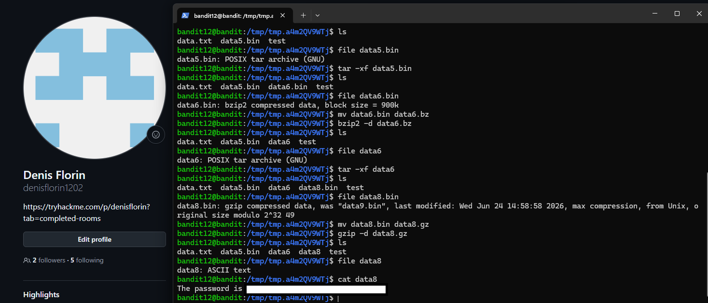

# Level 12 → 13

## Task

The password for the next level is stored in `data.txt`, which is a **hexdump of a file that has been repeatedly compressed**.

For this level, a temporary working directory under `/tmp` is useful. The command `mktemp -d` can be used to create one with a hard-to-guess name.

The `data.txt` file is then copied into the temporary directory using `cp`, where the different compression layers can be analyzed and extracted.

## Commands Used

- `mktemp -d` — creates a temporary directory.
- `cp data.txt /tmp/...` — copies `data.txt` into the temporary directory.
- `cd /tmp/...` — changes to the temporary working directory.
- `head data.txt` — displays the beginning of the file and helps identify the hexdump format.
- `xxd -r data.txt test` — reverses the hexdump and reconstructs the original binary data.
- `file <file>` — identifies the actual file type.
- `mv <file> <file>.gz` — renames a file to use the `.gz` extension.
- `gzip -d <file>.gz` — decompresses gzip data.
- `mv <file> <file>.bz` — renames a file for bzip2 decompression.
- `bzip2 -d <file>.bz` — decompresses bzip2 data.
- `tar -xf <file>` — extracts a TAR archive.
- `ls` — lists the files created after extraction.
- `cat data8` — displays the final ASCII text containing the password.

## Command Breakdown

First, I created a temporary directory and copied `data.txt` into it:

```bash
mktemp -d
cp data.txt /tmp/tmp.a4m2QV9WTj
cd /tmp/tmp.a4m2QV9WTj
```

I inspected the beginning of `data.txt`:

```bash
head data.txt
```

The output had the typical structure of a hexdump:

```text
00000000: 1f8b 0808 ...
00000010: 6269 6e00 ...
```

The left side represents offsets, while the middle contains bytes written in hexadecimal.

I reversed the hexdump:

```bash
xxd -r data.txt test
```

Then I checked the file type:

```bash
file test
```

The result showed:

```text
gzip compressed data
```

I renamed the file and decompressed it:

```bash
mv test test.gz
gzip -d test.gz
```

The next layer was identified as bzip2:

```bash
file test
```

```text
bzip2 compressed data
```

So I decompressed it:

```bash
mv test test.bz
bzip2 -d test.bz
```

The result was another gzip-compressed file:

```bash
file test
```

```text
gzip compressed data
```

I decompressed it again:

```bash
mv test test.gz
gzip -d test.gz
```

The result was now a TAR archive:

```bash
file test
```

```text
POSIX tar archive (GNU)
```

I extracted the archive:

```bash
tar -xf test
ls
```

This created:

```text
data5.bin
```

I checked its type:

```bash
file data5.bin
```

It was another TAR archive:

```text
POSIX tar archive (GNU)
```

So I extracted it:

```bash
tar -xf data5.bin
ls
```

This created:

```text
data6.bin
```

I checked the new file:

```bash
file data6.bin
```

The result was:

```text
bzip2 compressed data
```

I decompressed it:

```bash
mv data6.bin data6.bz
bzip2 -d data6.bz
```

Then I checked the result:

```bash
file data6
```

It was another TAR archive:

```text
POSIX tar archive (GNU)
```

I extracted it:

```bash
tar -xf data6
ls
```

This created:

```text
data8.bin
```

I checked its type:

```bash
file data8.bin
```

The result was:

```text
gzip compressed data
```

I renamed and decompressed it:

```bash
mv data8.bin data8.gz
gzip -d data8.gz
```

Finally, I checked the resulting file:

```bash
file data8
```

The result was:

```text
ASCII text
```

So I displayed its contents:

```bash
cat data8
```

The main idea of this level was to repeatedly use:

```text
file → identify format → decompress/extract → check again
```

until the final file became readable ASCII text.

## Screenshots

### Step 1 — Reverse Hexdump and Initial Decompression



### Step 2 — TAR and Bzip2 Layers



### Step 3 — Final Decompression and Password



## Password

<details>
<summary>Click to reveal</summary>

`qQYQiHOBPR8zR61qxYqX45quvihF2uzk`

</details>
