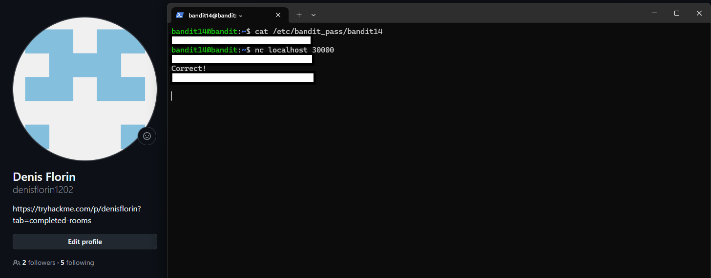

# Level 14 → 15

## Task

The password for the next level can be retrieved by submitting the password of the current level to port `30000` on `localhost`.

## Commands Used

- `cat /etc/bandit_pass/bandit14` — displays the password of the current `bandit14` user.
- `nc localhost 30000` — opens a TCP connection to the service listening on port `30000` of the local machine.

## Command Breakdown

First, I retrieved the password for the current level:

```bash
cat /etc/bandit_pass/bandit14
```

Then I connected to the service running on port `30000`:

```bash
nc localhost 30000
```

Here:

```text
nc        → Netcat, used to open TCP/UDP connections
localhost → the current machine
30000     → the destination TCP port
```

After the connection was established, the service waited for input.

I submitted the current `bandit14` password:

```text
aaWecNkG4FhxJQxz07uiwzVP6bJiYS65
```

The service responded with:

```text
Correct!
```

followed by the password for the next level.

The main concept of this level was communicating with a service running on a local TCP port using Netcat.

```text
current password
      ↓
nc localhost 30000
      ↓
local TCP service
      ↓
next password
```

## Screenshot



## Password

<details>
<summary>Click to reveal</summary>

`pbLYuZtTg4MgaqfJx8jbA9gKKGqM68A7`

</details>
