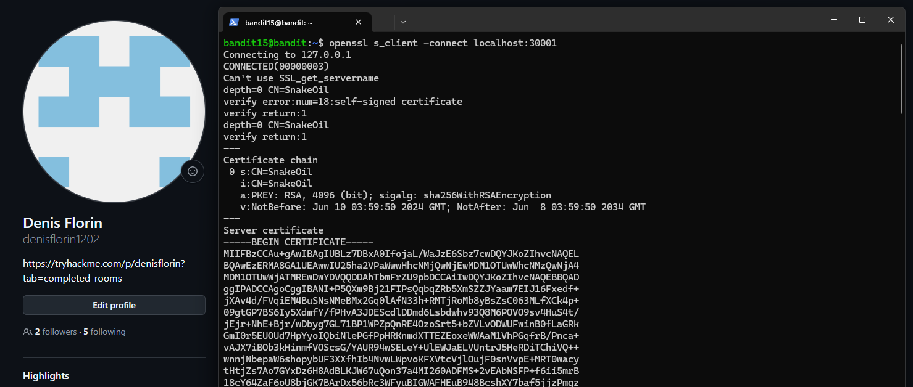
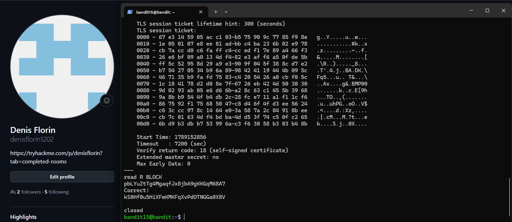

# Level 15 → 16

## Task

The password for the next level can be retrieved by submitting the password of the current level to port `30001` on `localhost` using SSL/TLS encryption.

## Commands Used

- `openssl s_client -connect localhost:30001` — opens an SSL/TLS connection to the service listening on port `30001`.

## Command Breakdown

I connected to the service running on port `30001` using OpenSSL:

```bash
openssl s_client -connect localhost:30001
```

Here:

```text
openssl   → cryptography and SSL/TLS toolkit
s_client  → OpenSSL client used to establish and inspect TLS connections
-connect  → specifies the destination
localhost → the current machine
30001     → the destination port
```

After connecting, OpenSSL performed a TLS handshake with the server.

The output showed that the connection was successfully established:

```text
CONNECTED(00000003)
```

The server presented a self-signed certificate:

```text
verify error:num=18:self-signed certificate
```

This means that the certificate was signed by the server itself instead of by a trusted Certificate Authority.

The connection successfully negotiated:

```text
Protocol: TLSv1.3
Cipher: TLS_AES_256_GCM_SHA384
```

After the TLS handshake was completed, OpenSSL waited for input:

```text
read R BLOCK
```

I then submitted the current `bandit15` password through the encrypted connection.

The server responded with:

```text
Correct!
```

followed by the password for the next level.

The main difference from the previous level is that the communication with the service is now protected using SSL/TLS.

```text
Level 14 → 15:

password
   ↓
nc localhost 30000
   ↓
plain TCP connection


Level 15 → 16:

password
   ↓
openssl s_client
   ↓
TLS handshake
   ↓
encrypted connection to localhost:30001
   ↓
next password
```

## Screenshots

### Step 1 — Establishing the TLS Connection



### Step 2 — Submitting the Password and Receiving the Result



## Password

<details>
<summary>Click to reveal</summary>

`kS0Hf0u5HiXFwKMKFqXvPdOTNGGa0X8V`

</details>
