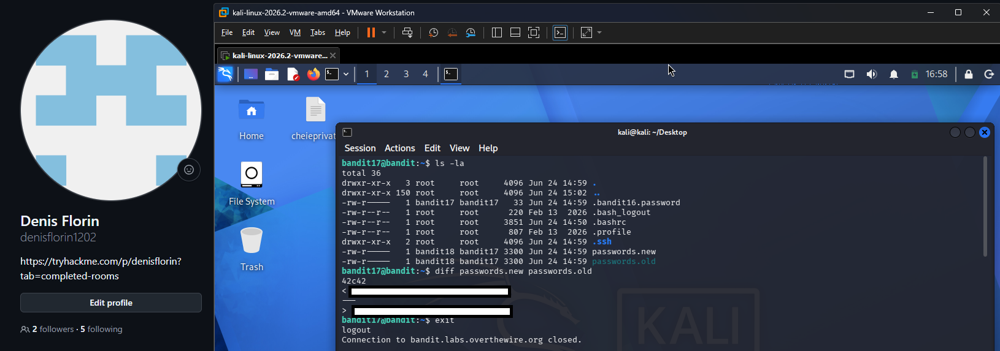
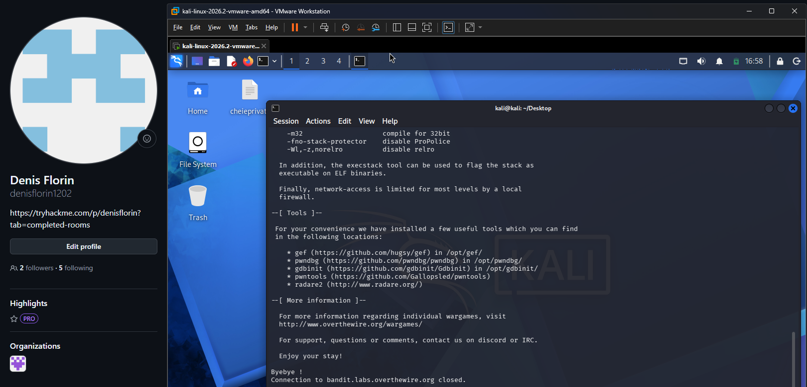

# Bandit Level 17 → Level 18

## Task

There are two files in the home directory: `passwords.old` and `passwords.new`.

The password for the next level is stored in `passwords.new` and is the only line that has changed between the two files.

## Commands Used

- `ls -la` — lists all files in the current directory.
- `diff` — compares two files and shows the differences between them.

## Command Breakdown

```bash
ls -la
```

This revealed the two relevant files:

- `passwords.old`
- `passwords.new`

I then compared them using:

```bash
diff passwords.new passwords.old
```

The output showed the only line that differed between the two files. Since `passwords.new` was given first, the line marked with `<` represents the password from the new file.

## Screenshots



After identifying the changed password, I exited the `bandit17` SSH session.



## Password

<details>
<summary>Click to reveal</summary>

`OQxXZjELndr90zuhOTDYBEomI0SZITXI`


</details>
