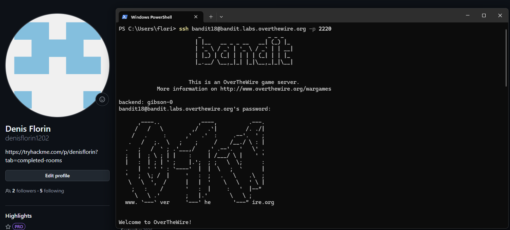
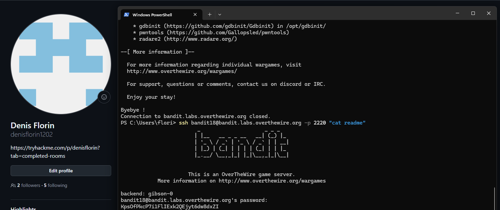

# Bandit Level 18 → Level 19

## Task

The password for the next level is stored in a file called `readme` in the home directory.

However, the `.bashrc` file has been modified to log the user out immediately when connecting through a normal SSH session.

## Commands Used

- `ssh` — connects securely to a remote machine and can also execute a command directly.
- `cat` — displays the contents of a file.

## Command Breakdown

First, I tried connecting normally:

```bash
ssh bandit18@bandit.labs.overthewire.org -p 2220
```

The authentication succeeded, but the modified `.bashrc` immediately terminated the shell:

```text
Byebye!
Connection to bandit.labs.overthewire.org closed.
```



Instead of opening an interactive shell, I used SSH to execute the required command directly on the remote server:

```bash
ssh bandit18@bandit.labs.overthewire.org -p 2220 "cat readme"
```

This connects to the server, executes `cat readme`, returns the output, and then closes the connection.



## Password

<details>
<summary>Click to reveal</summary>

`Kps0fPRcP7i1FLIExk2QEjyT6dW8dxZI`

</details>
