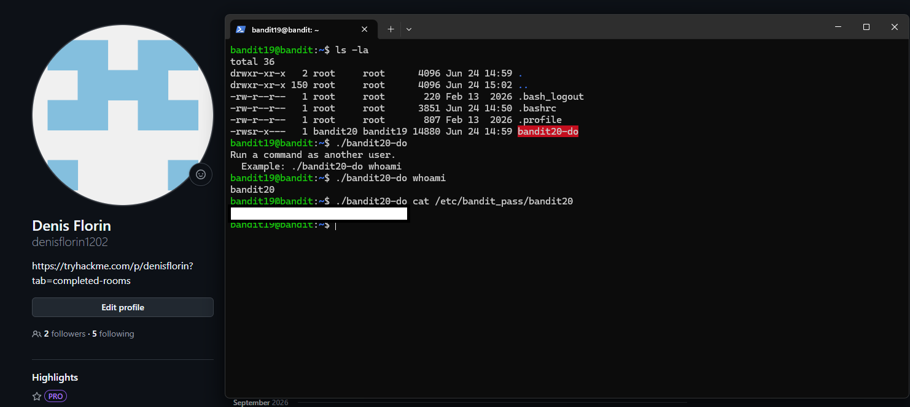

# Bandit Level 19 → Level 20

## Task

To gain access to the next level, I had to use the `setuid` binary located in the home directory.

The binary had to be executed without arguments first in order to see how it should be used. After that, it could be used to access the password stored in `/etc/bandit_pass/bandit20`.

## Commands Used

- `ls -la` — lists files and shows permissions.
- `./bandit20-do` — runs the setuid binary from the current directory.
- `whoami` — shows the current effective user.
- `cat` — displays the contents of a file.

## Command Breakdown

First, I listed the files in the home directory:

```bash
ls -la
```

The file `bandit20-do` had the following permissions:

```text
-rwsr-x---
```

The `s` in the owner's execute position shows that the file has the `setuid` bit enabled.

I then executed the binary without arguments:

```bash
./bandit20-do
```

It displayed its usage and showed that it can run a command as another user.

To confirm this, I ran:

```bash
./bandit20-do whoami
```

The output was:

```text
bandit20
```

This confirmed that commands executed through `bandit20-do` run with the privileges of `bandit20`.

Finally, I used the binary to read the password file:

```bash
./bandit20-do cat /etc/bandit_pass/bandit20
```

## Screenshots



## Password

<details>
<summary>Click to reveal</summary>

`4pIjcunZ0fK2vmp3IwfG8Vf7VhxD6pOA`

</details>
