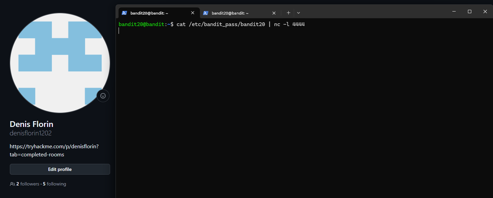
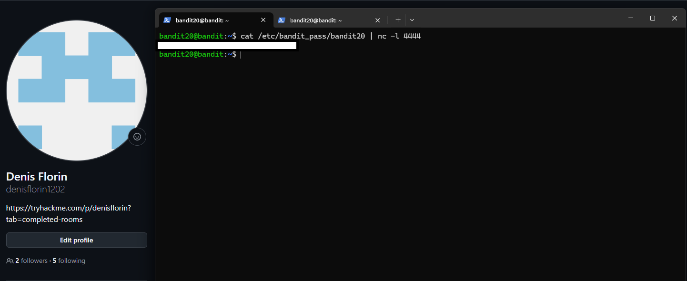

# Bandit Level 20 → Level 21

## Task

There is a `setuid` binary in the home directory that connects to `localhost` on a port specified as a command-line argument.

The program reads one line from that connection and compares it with the password for `bandit20`. If the password is correct, it sends back the password for `bandit21`.

## Commands Used

- `cat` — reads the current password from `/etc/bandit_pass/bandit20`.
- `nc` — creates a listener on a chosen local port.
- `./suconnect` — connects to the specified localhost port and verifies the received password.

## Command Breakdown

First, I created a listener on port `4444` and piped the current password into it:

```bash
cat /etc/bandit_pass/bandit20 | nc -l 4444
```

This means:

```text
cat password
     ↓
pipe |
     ↓
nc listener on port 4444
```

The listener waits for another program to connect and sends the `bandit20` password through that connection.



In another terminal, I ran the setuid binary and told it to connect to the same port:

```bash
./suconnect 4444
```

`suconnect` connected to the Netcat listener, read the password, compared it with the correct `bandit20` password, and confirmed:

```text
Password matches, sending next password
```


The password for `bandit21` was then sent back through the same connection and appeared in the terminal running `nc`.



## Password

<details>
<summary>Click to reveal</summary>

`PASSWORD`

</details>
