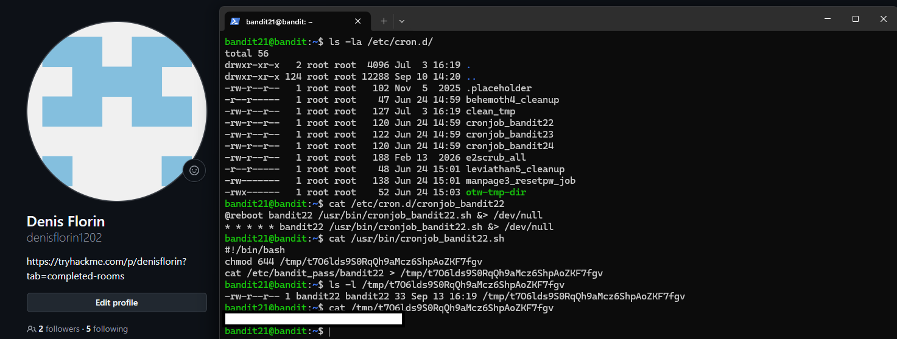

# Bandit Level 21 → Level 22

## Task

A program is running automatically at regular intervals using `cron`, the time-based job scheduler.

The goal was to inspect `/etc/cron.d/`, identify the cron job related to `bandit22`, and determine what command was being executed.

## Commands Used

- `ls -la` — lists files and their permissions.
- `cat` — displays the contents of files.
- `cron` — service that automatically executes scheduled jobs.

## Command Breakdown

First, I listed the cron configuration files:

```bash
ls -la /etc/cron.d/
```

I found the following relevant file:

```text
cronjob_bandit22
```

I inspected it with:

```bash
cat /etc/cron.d/cronjob_bandit22
```

The configuration showed:

```text
@reboot bandit22 /usr/bin/cronjob_bandit22.sh &> /dev/null
* * * * * bandit22 /usr/bin/cronjob_bandit22.sh &> /dev/null
```

This means that `/usr/bin/cronjob_bandit22.sh` is executed as `bandit22` at system startup and once every minute.

I then inspected the script:

```bash
cat /usr/bin/cronjob_bandit22.sh
```

The script contained:

```bash
#!/bin/bash
chmod 644 /tmp/t7O6lds9S0RqQh9aMcz6ShpAoZKF7fgv
cat /etc/bandit_pass/bandit22 > /tmp/t7O6lds9S0RqQh9aMcz6ShpAoZKF7fgv
```

The script copies the `bandit22` password into a file inside `/tmp` and gives that file permissions `644`, meaning it can be read by other users.

I checked the file:

```bash
ls -l /tmp/t7O6lds9S0RqQh9aMcz6ShpAoZKF7fgv
```

Finally, I read its contents:

```bash
cat /tmp/t7O6lds9S0RqQh9aMcz6ShpAoZKF7fgv
```



## Password

<details>
<summary>Click to reveal</summary>

`RYVux2rHEm9tiXHmLFzuR7Vhx6AZQMEz`

</details>
