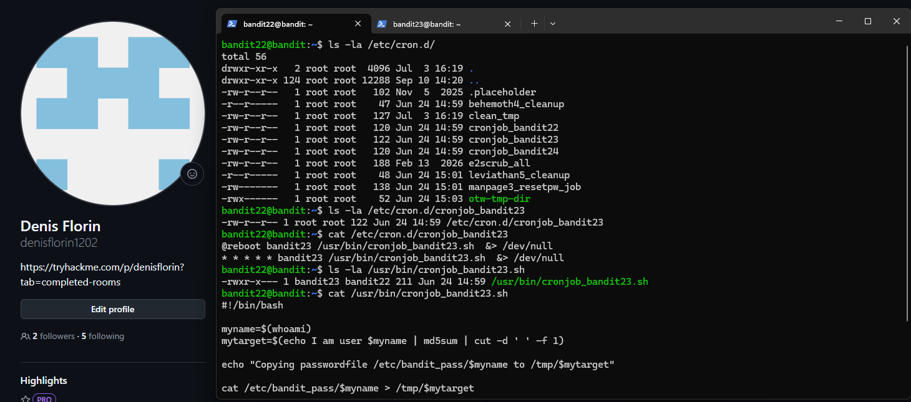
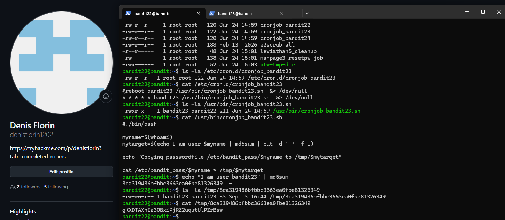
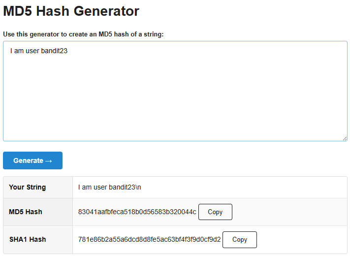

# Bandit Level 22 → Level 23

## Task

Another program is being executed automatically using `cron`.

The goal was to inspect the cron configuration for `bandit23`, understand how the script generates the name of a file in `/tmp`, and locate the password for the next level.

## Commands Used

- `ls -la` — lists files and their permissions.
- `cat` — displays the contents of a file.
- `echo` — outputs text and adds a newline by default.
- `md5sum` — calculates the MD5 hash of input.
- `cut` — extracts specific fields from text.

## Command Breakdown

First, I inspected the cron jobs:

```bash
ls -la /etc/cron.d/
```

I found:

```text
cronjob_bandit23
```

I then inspected its configuration:

```bash
cat /etc/cron.d/cronjob_bandit23
```

The cron job executes:

```text
/usr/bin/cronjob_bandit23.sh
```

as the user `bandit23` every minute.

Next, I inspected the script:

```bash
cat /usr/bin/cronjob_bandit23.sh
```

The important part was:

```bash
myname=$(whoami)
mytarget=$(echo I am user $myname | md5sum | cut -d ' ' -f 1)
```

Because the script runs as `bandit23`, `whoami` returns:

```text
bandit23
```

Therefore, the script calculates the MD5 hash of:

```text
I am user bandit23
```



To reproduce the same calculation, I used:

```bash
echo "I am user bandit23" | md5sum
```

This produced:

```text
8ca319486bfbbc3663ea0fbe81326349
```

The script uses this hash as the filename inside `/tmp`.

I then checked the generated file:

```bash
ls -la /tmp/8ca319486bfbbc3663ea0fbe81326349
```

and read it using:

```bash
cat /tmp/8ca319486bfbbc3663ea0fbe81326349
```



### Note about the newline

`echo` automatically adds a newline (`\n`) after the text.

Therefore:

```bash
echo "I am user bandit23" | md5sum
```

calculates the hash of the text **including a real newline character**.

Typing `\n` manually into an online MD5 generator is not necessarily the same thing, because the website may interpret `\` and `n` as two normal characters instead of an actual newline.

This is why the online generator produced a different hash.



## Password

<details>
<summary>Click to reveal</summary>

`gKXDTAXnIz3OBxiPjRZ2uqutULPZrBsw`

</details>
