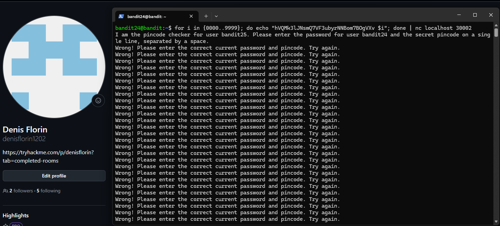
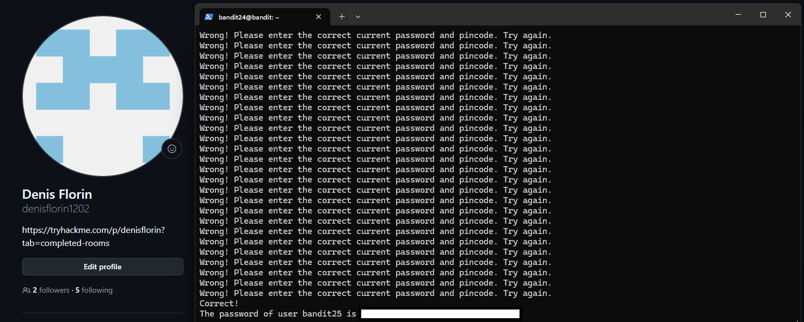

# Level 24 → 25

## Task

In this level, a daemon is listening on port `30002`.  
The daemon gives the password for `bandit25` only if it receives two values on the same line:

- the current password for `bandit24`
- a secret numeric 4-digit PIN code

The PIN cannot be retrieved directly, so it must be brute-forced by trying all combinations from `0000` to `9999`.

## Commands Used

- `for i in {0000..9999}; do ...; done` — generates all possible 4-digit PIN codes.
- `echo "<bandit24_password> $i"` — prints the current password together with each PIN.
- `|` — sends the generated output to the next command.
- `nc localhost 30002` — connects to the daemon running locally on port `30002`.

## Command Breakdown

I generated all possible PIN codes using a Bash loop:

`for i in {0000..9999}; do echo "<bandit24_password> $i"; done`

The expression `{0000..9999}` generates every number from `0000` to `9999`, keeping the 4-digit format.

For each value, the command sends one line in this format:

`<bandit24_password> <PIN>`

Then I piped all generated attempts into `nc`, which connected to the daemon on port `30002`:

`for i in {0000..9999}; do echo "<bandit24_password> $i"; done | nc localhost 30002`

This works because the level says that we do not need to create a new connection for each attempt.  
Instead, all PIN attempts are sent through a single connection.

Most attempts returned:

`Wrong! Please enter the correct current password and pincode. Try again.`

When the correct PIN was reached, the daemon responded with:

`Correct!`

and revealed the password for `bandit25`.

## Screenshots

## Password

Click to reveal

`SoHfqMOEqIX2IYKVciZxvgpR9a2Djx4P`

